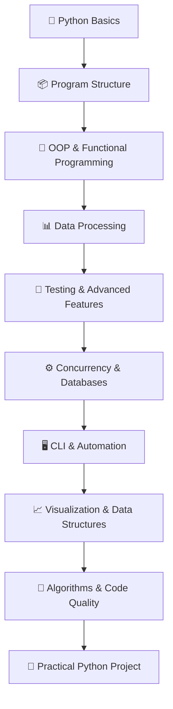

# 🐍 Python Programming Labs

<p align="center">
  
  
  
  
  
</p>

<p align="center">
  <strong>A structured, hands-on Python programming curriculum covering 40 practical labs — from environment setup and fundamentals to automation, algorithms, and a final CLI project.</strong>
</p>

---

## 📌 About This Repository

**Python Programming Labs** is a structured, practical Python learning repository containing **40 hands-on labs organized into 10 progressive sections**.

The curriculum starts with Python fundamentals and gradually develops practical programming skills through:

- 🐍 Python fundamentals
- 📦 Modules and packages
- 📁 File handling
- ⚠️ Exception handling
- 🧩 Object-oriented programming
- 🔄 Functional programming
- 📊 Data processing
- 🔎 Regular expressions
- 🧪 Unit testing
- ⚙️ Concurrency
- 🗄️ SQLite databases
- 🖥️ CLI applications
- 📝 Logging
- 🤖 Automation
- 🌐 HTTP/API interaction
- 📈 Data visualization
- 🧠 Algorithms
- ✨ Code quality
- 🚀 A final practical project

The goal is not simply to collect Python syntax examples, but to build a **progressive programming portfolio with practical evidence and increasingly realistic applications**.

---

# 📊 Course Overview

| Metric | Details |
|---|---|
| 🐍 Language | Python 3.x |
| 📚 Sections | 10 |
| 🧪 Practical Labs | 40 |
| 📈 Difficulty | Beginner → Advanced |
| 🖥️ Development | CLI / Scripts / Applications |
| 🌐 APIs | HTTP & JSON |
| 🗄️ Database | SQLite |
| 🧪 Testing | `unittest` |
| 📝 Logging | Python `logging` |
| 📊 Visualization | `matplotlib` |
| 🏁 Final Project | CLI Data Processor |

---

# 🗺️ Learning Roadmap

```mermaid
flowchart LR
    A["🐍 Section 01<br/>Python Fundamentals<br/>Labs 01–10"]
    B["📦 Section 02<br/>Modules, Files & Errors<br/>Labs 11–16"]
    C["🧩 Section 03<br/>OOP & Functional Python<br/>Labs 17–20"]
    D["📊 Section 04<br/>Data Processing & Patterns<br/>Labs 21–24"]
    E["🧪 Section 05<br/>Testing & Advanced Features<br/>Labs 25–27"]
    F["⚙️ Section 06<br/>Concurrency & Databases<br/>Labs 28–30"]
    G["🖥️ Section 07<br/>CLI, Logging & Automation<br/>Labs 31–34"]
    H["📈 Section 08<br/>Visualization & Data Structures<br/>Labs 35–36"]
    I["🧠 Section 09<br/>Algorithms & Code Quality<br/>Labs 37–39"]
    J["🚀 Section 10<br/>Final Python Project<br/>Lab 40"]

    A --> B --> C --> D --> E --> F --> G --> H --> I --> J
```



---

# 📚 Complete Curriculum

## 🐍 Section 01 — Python Fundamentals

**Labs 01–10**

Build a strong foundation in Python syntax, variables, control flow, collections, and functions.

| Lab | Topic |
|---|---|
| 01 | Installing Python & Environment Setup |
| 02 | Hello World & Basic Syntax |
| 03 | Data Types & Variables |
| 04 | Arithmetic & Expressions |
| 05 | Understanding Conditionals |
| 06 | For & While Loops |
| 07 | Lists & List Methods |
| 08 | Tuples & Sets |
| 09 | Dictionaries & Key Operations |
| 10 | Basic Functions |

### Skills Developed

```text
Python Environment
      ↓
Basic Syntax
      ↓
Variables & Data Types
      ↓
Expressions
      ↓
Conditionals
      ↓
Loops
      ↓
Collections
      ↓
Functions
```

---

# 📦 Section 02 — Modules, Files & Error Handling

**Labs 11–16**

Learn how to structure Python programs, work with files and JSON, handle errors, debug applications, and isolate dependencies.

| Lab | Topic |
|---|---|
| 11 | Modules & Packages |
| 12 | File I/O Basics |
| 13 | Handling Exceptions |
| 14 | JSON Handling |
| 15 | Basic Debugging Techniques |
| 16 | Virtual Environments (`venv`) |

### Key Skills

- Modules and packages
- File reading and writing
- Exception handling
- JSON serialization
- Debugging with `pdb`
- Virtual environments
- Dependency isolation

---

# 🧩 Section 03 — Object-Oriented & Functional Python

**Labs 17–20**

Move beyond basic scripting and learn reusable programming patterns.

| Lab | Topic |
|---|---|
| 17 | OOP: Defining Classes |
| 18 | OOP: Inheritance Basics |
| 19 | Basic Recursion Example |
| 20 | Lambda & Higher-Order Functions |

### Concepts

```text
Classes & Objects
       ↓
Inheritance
       ↓
Code Reusability
       ↓
Recursion
       ↓
Lambda Functions
       ↓
Higher-Order Functions
```

---

# 📊 Section 04 — Data Processing & Pattern Matching

**Labs 21–24**

Develop practical skills for transforming, reading, and analyzing structured data.

| Lab | Topic |
|---|---|
| 21 | List & Dictionary Comprehensions |
| 22 | Reading CSV Files |
| 23 | Using `requests` for HTTP Calls |
| 24 | Basic Regular Expressions |

### Technologies

- Python comprehensions
- CSV
- HTTP
- REST APIs
- JSON
- Regular expressions

### Practical Flow

```text
Raw Data
   ↓
Read / Fetch
   ↓
Process
   ↓
Transform
   ↓
Filter / Match
   ↓
Useful Information
```

---

# 🧪 Section 05 — Testing & Advanced Python Features

**Labs 25–27**

Introduce software reliability, reusable behavior, and safe resource management.

| Lab | Topic |
|---|---|
| 25 | Intro to Unit Testing with `unittest` |
| 26 | Decorators: Basic Usage |
| 27 | Context Managers (`with` Statement) |

### Key Skills

- Unit testing
- Assertions
- Test discovery
- Decorators
- `*args` and `**kwargs`
- Context managers
- Resource cleanup

---

# ⚙️ Section 06 — Concurrency & Databases

**Labs 28–30**

Explore concurrent execution and persistent data storage.

| Lab | Topic |
|---|---|
| 28 | Multithreading Basics |
| 29 | Multiprocessing Basics |
| 30 | Basic SQLite Usage |

### Architecture

```text
                 Python Application
                        │
             ┌──────────┴──────────┐
             ↓                     ↓
       Concurrency             Data Storage
             │                     │
      ┌──────┴──────┐              ↓
      ↓             ↓           SQLite
   Threads      Processes
```

### Skills Developed

- Thread creation
- Thread synchronization concepts
- Shared memory considerations
- Process-based execution
- CPU-bound workloads
- SQLite connections
- SQL queries
- Parameterized queries

---

# 🖥️ Section 07 — CLI, Logging & Automation

**Labs 31–34**

Build practical scripts that interact with users, produce useful logs, and automate repetitive tasks.

| Lab | Topic |
|---|---|
| 31 | CLI Applications with `argparse` |
| 32 | Logging with Python's Logging Module |
| 33 | Basic Web Scraping with `requests` + BeautifulSoup |
| 34 | Simple Scripting for File Management |

### Automation Pipeline

```text
User Input
    ↓
CLI Arguments
    ↓
Python Script
    ↓
Validation
    ↓
Processing
    ↓
Logging
    ↓
Output
```

### Practical Skills

- Command-line interfaces
- Argument parsing
- Logging levels
- HTTP requests
- HTML parsing
- File automation
- `os`
- `shutil`

---

# 📈 Section 08 — Data Visualization & Data Structures

**Labs 35–36**

Learn to represent information visually and use specialized Python collection types.

| Lab | Topic |
|---|---|
| 35 | Quick Data Visualization with `matplotlib` |
| 36 | Using Collections (`deque`, `Counter`) |

### Concepts

```text
Data
 ↓
Process
 ↓
Analyze
 ├── Counter
 └── deque
 ↓
Visualize
 ↓
Interpret
```

---

# 🧠 Section 09 — Algorithms, Functions & Code Quality

**Labs 37–39**

Strengthen algorithmic thinking, Python function techniques, and professional coding practices.

| Lab | Topic |
|---|---|
| 37 | BFS/DFS Implementation |
| 38 | Parameter Passing & Unpacking |
| 39 | Python Style & PEP 8 Checks |

### Focus Areas

- Breadth-First Search
- Depth-First Search
- Graph traversal
- Function arguments
- Positional arguments
- Keyword arguments
- Argument unpacking
- PEP 8
- Code readability
- Maintainability

---

# 🚀 Section 10 — Final Python Project

**Lab 40**

## Final Mini-Project: Building a CLI Data Processor

The final project combines multiple skills developed throughout the curriculum.

### Project Components

```text
             ┌──────────────────────┐
             │   CLI Data Processor  │
             └──────────┬───────────┘
                        │
              ┌─────────┴─────────┐
              ↓                   ↓
        CLI Arguments          API Request
              │                   │
              └─────────┬─────────┘
                        ↓
                 Data Processing
                        │
              ┌─────────┴─────────┐
              ↓                   ↓
          Validation            Logging
              │                   │
              └─────────┬─────────┘
                        ↓
                  JSON Output
```

### Technologies Used

- Python
- `requests`
- `json`
- `argparse`
- `logging`
- Exception handling
- File I/O
- REST APIs

### Final Project Capabilities

The application can:

- Accept an API URL from the command line
- Fetch remote data
- Handle HTTP errors
- Parse JSON responses
- Validate returned data
- Save JSON data to a specified file
- Log application activity
- Handle unexpected errors

---

# 🎯 Skills Progression



---

# 🔐 Python for Cybersecurity

Although this repository focuses on Python programming, many of the skills developed here directly support **cybersecurity and cloud security work**.

### Security-Relevant Applications

| Python Skill | Cybersecurity Application |
|---|---|
| File I/O | Log processing & evidence handling |
| Exceptions | Reliable security automation |
| JSON | API and security-tool data |
| Regular Expressions | Log and pattern analysis |
| `requests` | API interaction |
| CLI tools | Security utilities |
| Logging | Monitoring & auditing |
| SQLite | Local security data storage |
| Multithreading | Concurrent tasks |
| Multiprocessing | CPU-intensive processing |
| Web scraping | Structured information collection |
| Automation | Repetitive security workflows |
| Algorithms | Security tooling & data processing |
| Testing | Reliable security scripts |

### Security Automation Flow

```text
Security Data
     ↓
Python Collection
     ↓
Validation
     ↓
Parsing
     ↓
Pattern Detection
     ↓
Analysis
     ↓
Logging
     ↓
Automated Response / Reporting
```

This makes Python an important foundation for areas such as:

- 🔐 Security Engineering
- ☁️ Cloud Security
- 🕵️ Detection Engineering
- 🤖 Security Automation
- 📊 Security Monitoring
- 🚨 Incident Investigation
- 🧰 Security Tool Development

---

# 🧪 Evidence & Screenshots

This repository follows a practical learning approach.

Where appropriate, labs can include evidence such as:

- Terminal output
- Program execution
- Test results
- API responses
- Generated files
- Database results
- Debugging sessions
- CLI interactions
- Visualizations
- Validation results

Example structure:

```text
lab-name/
├── README.md
├── script.py
└── screenshots/
    ├── execution.png
    ├── output.png
    └── verification.png
```

Screenshots should be used when they **prove practical execution or results**, rather than being added only for decoration.

---

# 🛠️ Technologies & Tools

<p align="center">
  
  
  
  
  
  
</p>

### Core Python Technologies

```text
Python 3.x
├── Standard Library
│   ├── os
│   ├── shutil
│   ├── json
│   ├── csv
│   ├── re
│   ├── sqlite3
│   ├── argparse
│   ├── logging
│   ├── threading
│   ├── multiprocessing
│   ├── unittest
│   └── collections
│
└── External Libraries
    ├── requests
    ├── BeautifulSoup
    └── matplotlib
```

---

# 📁 Repository Structure

```text
python-programming-labs/
│
├── 01-python-fundamentals/
│   ├── 01-installing-python-and-environment-setup/
│   ├── 02-hello-world-and-basic-syntax/
│   ├── 03-data-types-and-variables/
│   ├── 04-arithmetic-and-expressions/
│   ├── 05-understanding-conditionals/
│   ├── 06-for-and-while-loops/
│   ├── 07-lists-and-list-methods/
│   ├── 08-tuples-and-sets/
│   ├── 09-dictionaries-and-key-operations/
│   └── 10-basic-functions/
│
├── 02-modules-files-and-error-handling/
│   ├── 11-modules-and-packages/
│   ├── 12-file-io-basics/
│   ├── 13-handling-exceptions/
│   ├── 14-json-handling/
│   ├── 15-basic-debugging-techniques/
│   └── 16-virtual-environments-venv/
│
├── 03-object-oriented-and-functional-python/
│   ├── 17-oop-defining-classes/
│   ├── 18-oop-inheritance-basics/
│   ├── 19-basic-recursion-example/
│   └── 20-lambda-and-higher-order-functions/
│
├── 04-data-processing-and-pattern-matching/
│   ├── 21-list-dict-comprehensions/
│   ├── 22-reading-csv-files/
│   ├── 23-using-requests-for-http-calls/
│   └── 24-basic-regular-expressions/
│
├── 05-testing-and-advanced-python-features/
│   ├── 25-intro-to-unit-testing-with-unittest/
│   ├── 26-decorators-basic-usage/
│   └── 27-context-managers-with-statement/
│
├── 06-concurrency-and-databases/
│   ├── 28-multithreading-basics/
│   ├── 29-multiprocessing-basics/
│   └── 30-basic-sqlite-usage/
│
├── 07-cli-logging-and-automation/
│   ├── 31-cli-applications-with-argparse/
│   ├── 32-logging-with-python-logging/
│   ├── 33-web-scraping-with-requests-beautifulsoup/
│   └── 34-file-management-automation/
│
├── 08-data-visualization-and-data-structures/
│   ├── 35-quick-data-visualization-with-matplotlib/
│   └── 36-using-collections-deque-counter/
│
├── 09-algorithms-functions-and-code-quality/
│   ├── 37-bfs-dfs-implementation/
│   ├── 38-parameter-passing-and-unpacking/
│   └── 39-python-style-and-pep8-checks/
│
├── 10-final-python-project/
│   └── 40-final-mini-project-cli-data-processor/
│
├── .gitignore
└── README.md
```

> **Note:** The structure above represents the intended curriculum organization. Individual lab folder names should match the actual repository paths.

---

# 📊 Lab Distribution

```text
Section 01  ██████████  10 Labs
Section 02  ██████       6 Labs
Section 03  ████         4 Labs
Section 04  ████         4 Labs
Section 05  ███          3 Labs
Section 06  ███          3 Labs
Section 07  ████         4 Labs
Section 08  ██           2 Labs
Section 09  ███          3 Labs
Section 10  █             1 Lab
───────────────────────────────
TOTAL                     40 Labs
```

---

# 🧭 Learning Methodology

Each lab is designed around a practical progression:

```text
📖 Understand
     ↓
🧠 Learn the Concept
     ↓
💻 Implement
     ↓
🧪 Test
     ↓
🔎 Observe the Result
     ↓
📝 Document
     ↓
🔐 Connect to Real-World Use
```

The repository emphasizes **understanding through implementation**, rather than simply memorizing Python syntax.

---

# 🏆 Learning Milestones

| Milestone | Achievement |
|---|---|
| 🟢 Foundation | Complete Labs 01–10 |
| 🔵 Development | Complete Labs 11–20 |
| 🟣 Data & APIs | Complete Labs 21–24 |
| 🟠 Reliability | Complete Labs 25–27 |
| 🔴 Systems | Complete Labs 28–30 |
| 🟡 Automation | Complete Labs 31–34 |
| 📈 Data Skills | Complete Labs 35–36 |
| 🧠 Problem Solving | Complete Labs 37–39 |
| 🚀 Final Milestone | Complete Lab 40 |

---

# 🎯 Repository Objectives

By completing this curriculum, the learner should be able to:

- Understand Python programming fundamentals
- Build reusable Python programs
- Work with files and structured data
- Handle exceptions safely
- Debug Python applications
- Use virtual environments
- Apply object-oriented programming
- Use functional programming concepts
- Process CSV and JSON data
- Interact with HTTP APIs
- Work with regular expressions
- Write unit tests
- Use decorators and context managers
- Work with threads and processes
- Store and query data using SQLite
- Build command-line applications
- Implement logging
- Automate repetitive tasks
- Visualize data
- Implement common algorithms
- Follow Python coding standards
- Build a complete CLI application

---

# 💼 Portfolio Value

This repository is designed to demonstrate more than theoretical Python knowledge.

It provides evidence of practical experience with:

```text
Python Programming
       +
Problem Solving
       +
Automation
       +
Data Processing
       +
APIs
       +
Databases
       +
Testing
       +
Logging
       +
Algorithms
       +
Professional Documentation
       ↓
Practical Programming Portfolio
```

The project structure also provides a foundation for showcasing Python skills when applying for opportunities related to:

- Software Development
- Automation
- DevOps
- Cloud Engineering
- Cybersecurity
- Security Engineering
- Detection Engineering
- Security Automation
- Cloud Security

---

# ☁️ Cloud & Cybersecurity Relevance

Python is widely useful across modern cloud and cybersecurity workflows.

The skills developed in this repository can later be extended into projects involving:

```text
Python
 │
 ├── Linux Automation
 │
 ├── Cloud APIs
 │
 ├── AWS Automation
 │
 ├── Security APIs
 │
 ├── SIEM Data Processing
 │
 ├── Log Analysis
 │
 ├── Detection Engineering
 │
 ├── Security Automation
 │
 └── Incident Investigation
```

Future projects can build on this foundation by integrating Python with:

- Linux
- AWS
- SIEM platforms
- Security APIs
- Cloud logging
- Detection rules
- Security monitoring
- Automation frameworks

---

# 📌 Recommended Evidence Standard

For portfolio-quality labs, evidence should focus on **proof of work**.

### Good Evidence

- ✅ Script execution
- ✅ Correct output
- ✅ Successful test results
- ✅ API response
- ✅ Database query results
- ✅ CLI interaction
- ✅ Generated visualization
- ✅ Error handling demonstration
- ✅ Debugging output
- ✅ Final project execution

### Avoid

- ❌ Random decorative screenshots
- ❌ Screenshots without context
- ❌ Excessive duplicate images
- ❌ Sensitive credentials or tokens
- ❌ API keys
- ❌ Personal information

---

# 🔐 Security & Professional Practices

When working with Python projects:

- Never commit passwords or API keys.
- Never expose access tokens in screenshots.
- Use environment variables for secrets.
- Validate external input.
- Handle exceptions appropriately.
- Use parameterized SQL queries.
- Respect API terms of service.
- Respect website `robots.txt` and applicable policies.
- Avoid unnecessary collection of personal data.
- Keep dependencies isolated with virtual environments.
- Test code before considering it production-ready.
- Keep documentation synchronized with implementation.

---

# 📈 From Learning to Real Projects

The 40 labs provide a foundation for progressively larger projects.

```text
Labs
 ↓
Small Scripts
 ↓
Automation Tools
 ↓
API-Based Applications
 ↓
Security Utilities
 ↓
Cloud Automation
 ↓
Security Engineering Projects
```

Possible future extensions include:

- Log analysis tools
- Network utilities
- API automation tools
- Security monitoring scripts
- Cloud automation utilities
- SIEM data processors
- IOC processing tools
- Security reporting utilities
- Detection engineering helpers

---

# 🗂️ Quick Navigation

| Section | Labs | Focus |
|---|---:|---|
| [Section 01](./01-python-fundamentals/) | 01–10 | Python Fundamentals |
| [Section 02](./02-modules-files-and-error-handling/) | 11–16 | Modules, Files & Errors |
| [Section 03](./03-object-oriented-and-functional-python/) | 17–20 | OOP & Functional Python |
| [Section 04](./04-data-processing-and-pattern-matching/) | 21–24 | Data Processing & Patterns |
| [Section 05](./05-testing-and-advanced-python-features/) | 25–27 | Testing & Advanced Features |
| [Section 06](./06-concurrency-and-databases/) | 28–30 | Concurrency & Databases |
| [Section 07](./07-cli-logging-and-automation/) | 31–34 | CLI, Logging & Automation |
| [Section 08](./08-data-visualization-and-data-structures/) | 35–36 | Visualization & Data Structures |
| [Section 09](./09-algorithms-functions-and-code-quality/) | 37–39 | Algorithms & Code Quality |
| [Section 10](./10-final-python-project/) | 40 | Final Project |

---

# 🧑‍💻 Development Environment

The labs are designed around a standard Python development environment.

Typical tools include:

```text
Operating System
      ↓
Python 3.x
      ↓
VS Code / Code Editor
      ↓
Git
      ↓
GitHub
      ↓
Python Labs
```

The curriculum can be followed on Linux, Windows, or macOS with appropriate command adjustments.

---

# 📋 Completion Checklist

- [ ] Section 01 — Python Fundamentals
- [ ] Section 02 — Modules, Files & Error Handling
- [ ] Section 03 — Object-Oriented & Functional Python
- [ ] Section 04 — Data Processing & Pattern Matching
- [ ] Section 05 — Testing & Advanced Python Features
- [ ] Section 06 — Concurrency & Databases
- [ ] Section 07 — CLI, Logging & Automation
- [ ] Section 08 — Data Visualization & Data Structures
- [ ] Section 09 — Algorithms, Functions & Code Quality
- [ ] Section 10 — Final Python Project
- [ ] 40 Labs Completed
- [ ] Practical Evidence Added
- [ ] Final Project Completed
- [ ] Repository Documentation Reviewed

---

# 🚀 Final Milestone

Completing all 40 labs represents progression from:

```text
🐣 Beginner
    ↓
🐍 Python Programmer
    ↓
🧠 Problem Solver
    ↓
⚙️ Automation Developer
    ↓
📊 Data & API Developer
    ↓
🔐 Security-Focused Programmer
    ↓
🚀 Practical Python Portfolio
```

The final goal is to turn Python knowledge into **practical, documented, and demonstrable programming ability**.

---

# ⭐ Project Philosophy

> **Learn → Build → Test → Document → Improve**

Every lab is an opportunity to understand a concept, implement it, verify the result, document the work, and connect it to real-world applications.

This repository is intended to evolve over time as new projects, improvements, experiments, and security-focused applications are added.

---

# 📌 About the Author

This repository is part of a hands-on learning portfolio focused on developing practical skills in:

- 🐍 Python
- 🐧 Linux
- 🌐 Networking
- 🔐 Cybersecurity
- ☁️ Cloud Security
- 📊 SIEM & Security Monitoring
- 🤖 Security Automation

The long-term goal is to combine programming, Linux, networking, cloud technologies, and cybersecurity into practical engineering projects.

---

# 📜 License

This project is licensed under the **MIT License**.

---

<p align="center">
  <strong>🐍 Python Programming Labs</strong><br>
  <sub>40 Labs • 10 Sections • Beginner → Advanced • Practical Portfolio</sub>
</p>

<p align="center">
  ⭐ Star the repository if you find it useful.
</p>
